# Clean Code


* Readable and meaningful

* Reduce cognitive load

* Be concise and "to the point"

* Avoid unintuitive names, complex nesting and code blocks

* Follow common best practives and patterns

* Be fun to write and to maintain

  

_________


**Key Pain Points**

Names

* Variables
* Functions
* Classes


Structure & Comments

* Code Formatting
* Good & Bad Comments


Functions

* Length
* Parameters


Conditionals & Error Handling

* Deep Nesting
* Missing Error Handling


Classes & Data Structures

* Missing Distinction
* Bloated Classes


**Solution**

Rules & Concepts

Patterns & Principles

Test-Driven Development


## Naming


**Assigning Names to Variables, Functions, Classes & More**


How to name things correctly?


**Variables & Constants**

Data containers

e.g. user input data, validation results, a list of products

Use nouns or short phrases with adjectives

`const userData = { ... }`

`const isValid = ...`


**Function / Methods**

Commands or calculated values

e.g. send data to server, check if user input is valid

Use verbs or short phrases with adjectives

`sendData()`

`inputIsValid()`


**Classes**

Use classes to create "things"

e.g. a user, a product, a http request body

Use nouns or short phrases with nouns

`class User { ... }`

`class RequestBody { ... }`


| snake_case                    |           camelCase           |                    PascalCase |           kebab-case |
| :---------------------------- | :---------------------------: | ----------------------------: | -------------------: |
| is_valid, send_response       |     isValid, sendResponse     |     AdminRole, UserRepository |        <side-drawer> |
| e.g. Python                   |     e.g. Java, Javascript     | e.g. Python, Java, Javascript |            e.g. HTML |
| Variables, functions, methods | Variables, functions, methods |                       Classes | Custom HTML Elements |


**Naming Variables, Constants & Properties**

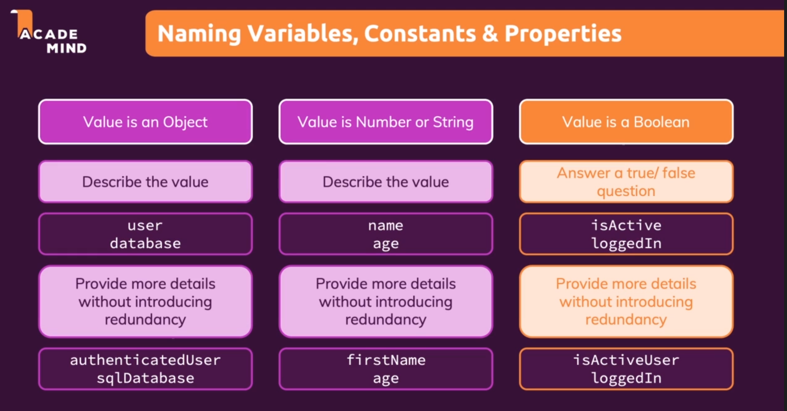


**Variable naming examples**


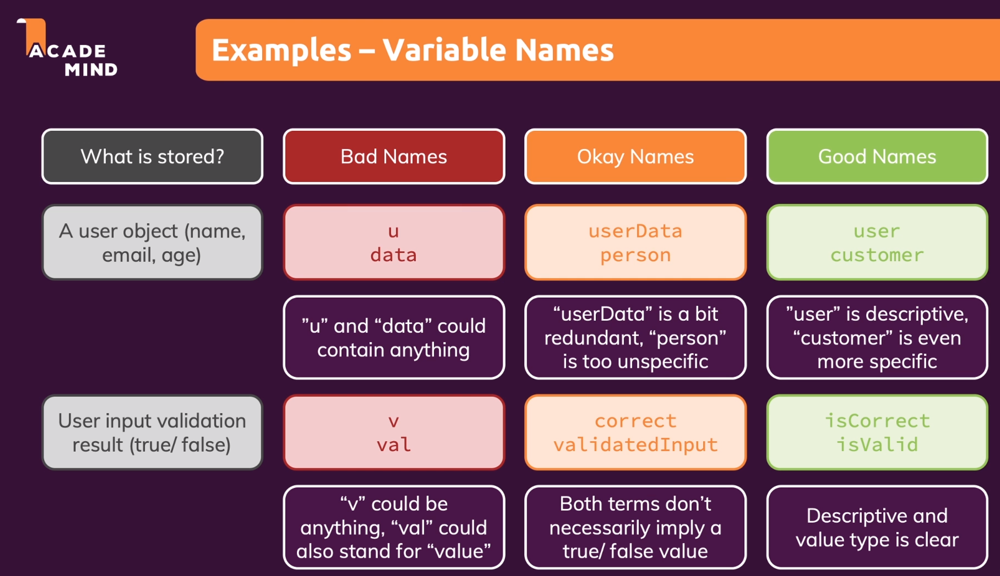


**Naming Functions & Methods**


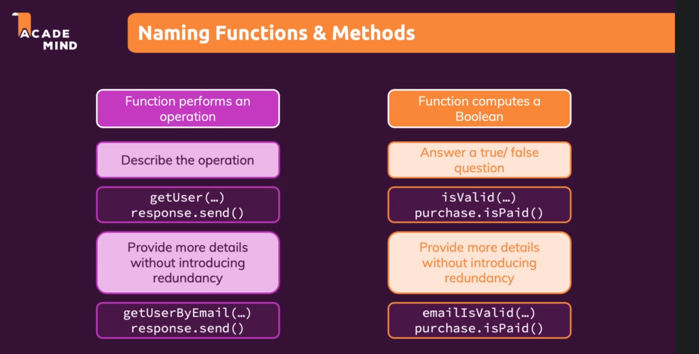


**Examples  Function/Method Names**


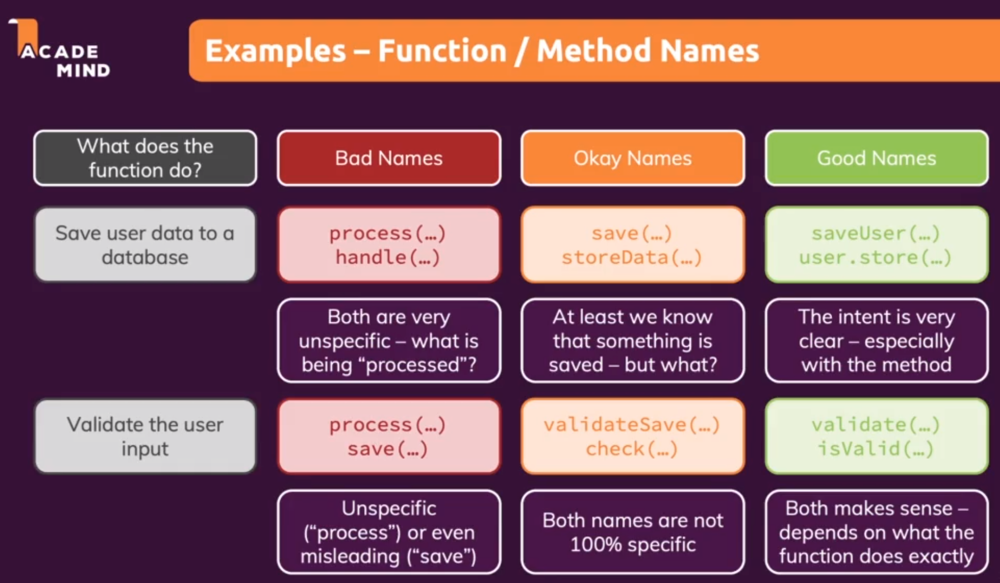


**Naming Classes**


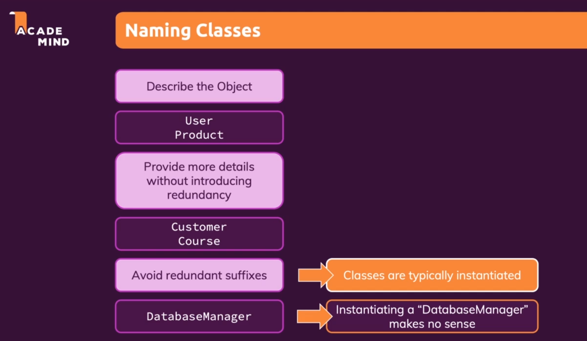


**Class name examples**

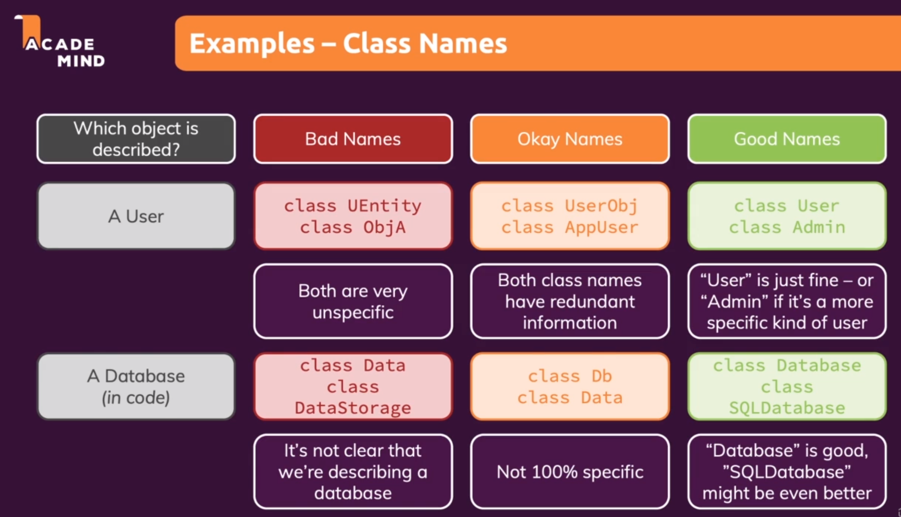


## Comments & Formatting


### Comments

Avoid Comments with only few exceptions


**Bad Comments**


* **Redundant Information**

  Comment self-explain variable names etc.

* **Dividers/Block Markers**

  ```typescript
  // *****************
  // GLOBALS
  // *****************
  let sqlDriver: any;
  let mongoDbDriver: any;
  
  // *****************
  // CLASSES
  // *****************
  class Database{
    ......
  }
  
  ```

* **Misleading Comments**

  ```typescript
  insertData(data:any){
    this.dbEngine.insert(data); // update a user ????????
  }
  ```

* **Commented-Out Code**


**Good Comments**

* Legal Informaiton
* Explanations which can't be replaced by good naming
* Warning
* Todo Notes


### Code Formating

Code formating improves Readability & Transports Meaning


**Vertical Formatting**

* Space between lines

* Grouping of code

  

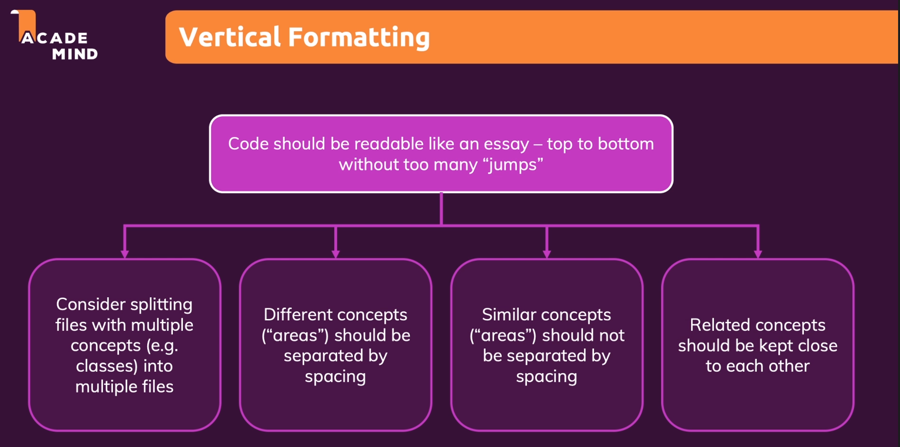


**Horizontal Formating**

* Indentation
* Space between code
* Line width

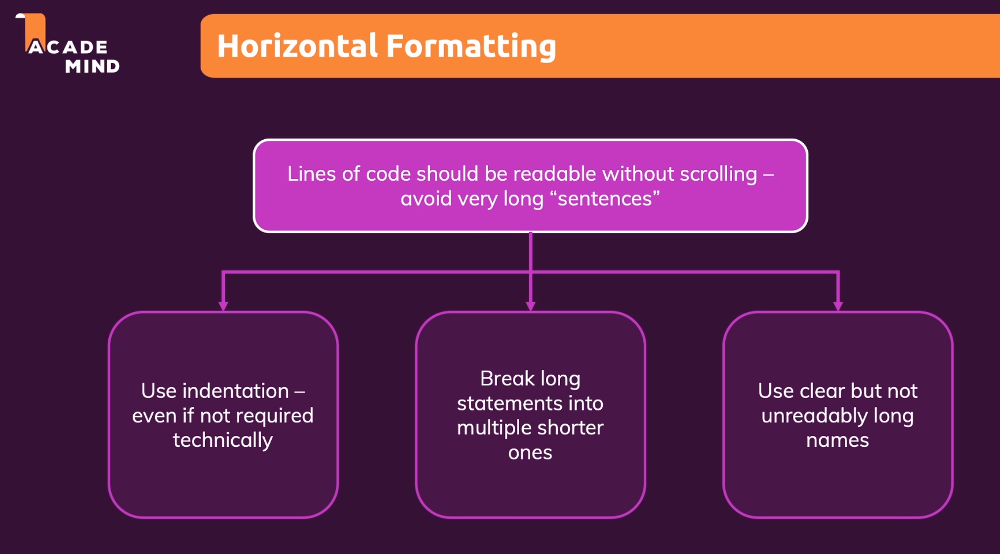


## Function & Methods


**The Number Of Function / Method Parameters**


Minimize the number of parameters!


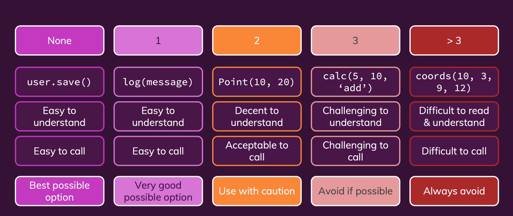


Replace multiple paramters with one parameter

```typescript

class User {
  constructor(name, age, email){
    this.name = name;
    this.age = age;
    this.email = email;
  }
}

// The order matters
const user = new User('Henry', 28, 'henrylong@gmail.com');

/******************** Better Approach *****************************/

class User {
  constrcutor(userData){
    this.name = userData.name;
    this.age = userData.age;
    this.email = userData.email;
  }
}

// The order doesn't matter
const user = new User({name:'Henry', email:'henrylong719@gmail.com', age: 28});

```


____


**Avoid output parameters**

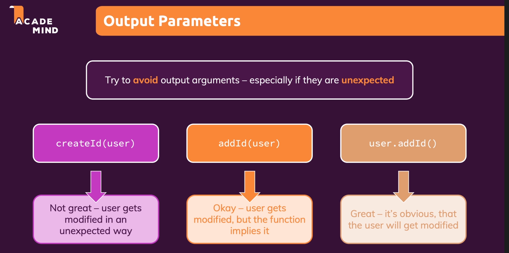


```javascript
function createId(user){
  user.id = 'u1;'
}

const user = {name: 'Henry'};
createId(user);

console.log(user)

---------------------------------------------------------------------------------------

class User{
  constructor(name){
    this.name = name;
  }
  
  addId(){
    this.id = 'u1';
  }
}


const costomer = new User('Henry');
customer.addId();
console.log(customer);


```


___


**Functions Should Do One Thing**


**Functions & Abstraction**

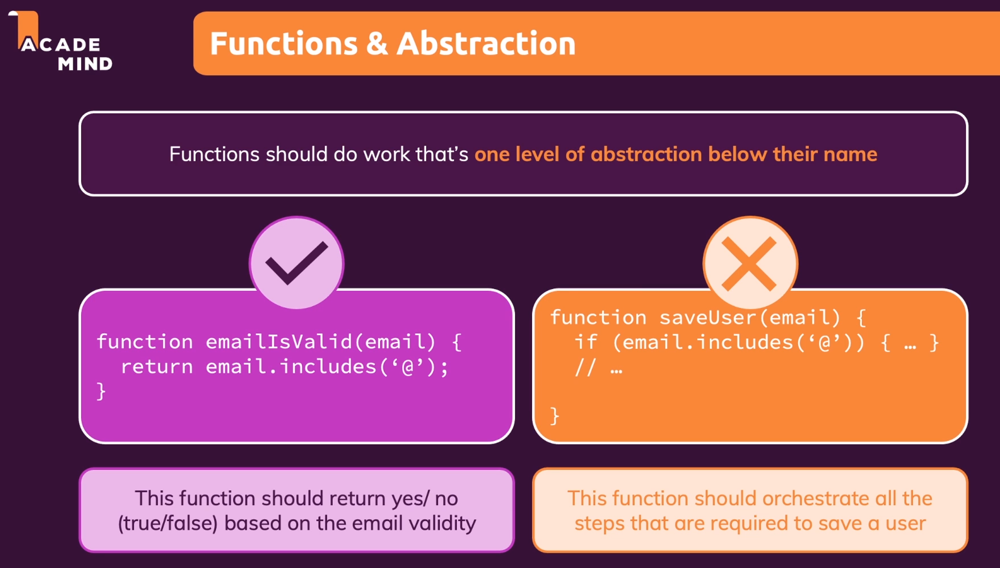


**The Rule of thumb for keeping functions short**


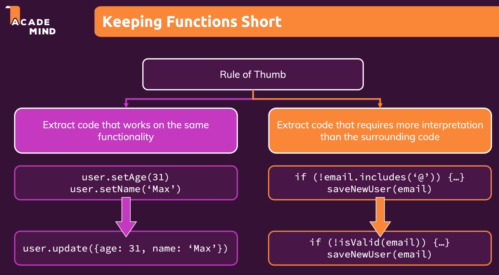


**Don't Repeat Yourself (DRY)**

Don't write the same code more than once

Signs of code which "is not DRY"

* You find yourself copy & pasting code
* You need to apply the same change to multiple places in your codebase


**Side Effect**

```javascript
function createUser(email, password){
  const user = new User(email, password);
  startSession(user);
  return user; 
}
```


A side effect is an operation which does not just act on function inputs and change the function output but which instead changes the overall system/program state.


Side effects are not automatically bad- we do need them in out programs. But unexpected side effects should be avoided.


# References 

https://www.udemy.com/course/writing-clean-code/

https://github.com/ryanmcdermott/clean-code-javascript

https://github.com/zedr/clean-code-python
