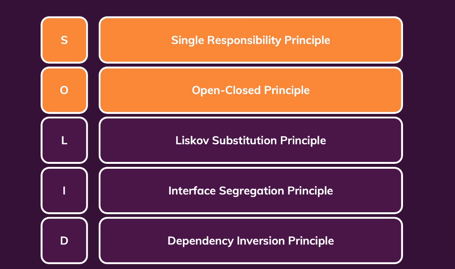

# Clean Code


* Readable and meaningful

* Reduce cognitive load

* Be concise and "to the point"

* Avoid unintuitive names, complex nesting and code blocks

* Follow common best practives and patterns

* Be fun to write and to maintain

  

_________


**Key Pain Points**

Names

* Variables
* Functions
* Classes


Structure & Comments

* Code Formatting
* Good & Bad Comments


Functions

* Length
* Parameters


Conditionals & Error Handling

* Deep Nesting
* Missing Error Handling


Classes & Data Structures

* Missing Distinction
* Bloated Classes


**Solution**

Rules & Concepts

Patterns & Principles

Test-Driven Development


## Naming


**Assigning Names to Variables, Functions, Classes & More**


How to name things correctly?


**Variables & Constants**

Data containers

e.g. user input data, validation results, a list of products

Use nouns or short phrases with adjectives

`const userData = { ... }`

`const isValid = ...`


**Function / Methods**

Commands or calculated values

e.g. send data to server, check if user input is valid

Use verbs or short phrases with adjectives

`sendData()`

`inputIsValid()`


**Classes**

Use classes to create "things"

e.g. a user, a product, a http request body

Use nouns or short phrases with nouns

`class User { ... }`

`class RequestBody { ... }`


| snake_case                    |           camelCase           |                    PascalCase |           kebab-case |
| :---------------------------- | :---------------------------: | ----------------------------: | -------------------: |
| is_valid, send_response       |     isValid, sendResponse     |     AdminRole, UserRepository |        <side-drawer> |
| e.g. Python                   |     e.g. Java, Javascript     | e.g. Python, Java, Javascript |            e.g. HTML |
| Variables, functions, methods | Variables, functions, methods |                       Classes | Custom HTML Elements |


**Naming Variables, Constants & Properties**


**Variable naming examples**


**Naming Functions & Methods**


**Examples  Function/Method Names**


**Naming Classes**


**Class name examples**


## Comments & Formatting


### Comments

Avoid Comments with only few exceptions


**Bad Comments**


* **Redundant Information**

  Comment self-explain variable names etc.

* **Dividers/Block Markers**

  ```typescript
  // *****************
  // GLOBALS
  // *****************
  let sqlDriver: any;
  let mongoDbDriver: any;
  
  // *****************
  // CLASSES
  // *****************
  class Database{
    ......
  }
  
  ```

* **Misleading Comments**

  ```typescript
  insertData(data:any){
    this.dbEngine.insert(data); // update a user ????????
  }
  ```

* **Commented-Out Code**


**Good Comments**

* Legal Informaiton
* Explanations which can't be replaced by good naming
* Warning
* Todo Notes


### Code Formating

Code formating improves Readability & Transports Meaning


**Vertical Formatting**

* Space between lines

* Grouping of code

  


**Horizontal Formating**

* Indentation
* Space between code
* Line width


## Function & Methods


**The Number Of Function / Method Parameters**


Minimize the number of parameters!


Replace multiple paramters with one parameter

```typescript

class User {
  constructor(name, age, email){
    this.name = name;
    this.age = age;
    this.email = email;
  }
}

// The order matters
const user = new User('Harry', 28, 'harry@gmail.com');

/******************** Better Approach *****************************/

class User {
  constrcutor(userData){
    this.name = userData.name;
    this.age = userData.age;
    this.email = userData.email;
  }
}

// The order doesn't matter
const user = new User({name:'Harry', email:'harry@gmail.com', age: 28});

```


____


**Avoid output parameters**


```javascript
function createId(user){
  user.id = 'u1;'
}

const user = {name: 'Ben'};
createId(user);

console.log(user)

---------------------------------------------------------------------------------------

class User{
  constructor(name){
    this.name = name;
  }
  
  addId(){
    this.id = 'u1';
  }
}


const costomer = new User('John');
customer.addId();
console.log(customer);


```


___


**Functions Should Do One Thing**


**Functions & Abstraction**


**The Rule of thumb for keeping functions short**


**Don't Repeat Yourself (DRY)**

Don't write the same code more than once

Signs of code which "is not DRY"

* You find yourself copy & pasting code
* You need to apply the same change to multiple places in your codebase


**Side Effect**

```javascript
function createUser(email, password){
  const user = new User(email, password);
  startSession(user);
  return user; 
}
```


A side effect is an operation which does not just act on function inputs and change the function output but which instead changes the overall system/program state.


Side effects are not automatically bad- we do need them in out programs. But unexpected side effects should be avoided.


## Control Structure & Errors


**Keep Your Control Structure Clean**


* Avoid Deep Nesting
* Using Factory Functions & Polymorphism
* Prefer Positive Checks (if `isEmpty` vs if `isNotEmpty` )
* Utilize Errors


**Use Guards & Fail Fast**


## Objects, Classes & Data Containers/Structure


**The Difference Between Objects & Data Structure**

**Object**

* Private internals / properties, public API (methods)
* Contain your business logic (in OOP)
* Abstractions over concretions


**Data Container / Data Structure**

* Public internals / properties, (almost) no API (methods)
* Store and transport data
* Concretions only


```typescript

type Purchase = any;

let Logistics: any;

interface Delivery {
  deliverProduct();
  trackProduct();
}

class DeliveryImplementation {
  protected purchase: Purchase;

  constructor(purchase: Purchase) {
    this.purchase = purchase;
  }
}

class ExpressDelivery extends DeliveryImplementation implements Delivery {
  deliverProduct() {
    Logistics.issueExpressDelivery(this.purchase.product);
  }

  trackProduct() {
    Logistics.trackExpressDelivery(this.purchase.product);
  }
}

class InsuredDelivery extends DeliveryImplementation implements Delivery {
  deliverProduct() {
    Logistics.issueInsuredDelivery(this.purchase.product);
  }

  trackProduct() {
    Logistics.trackInsuredDelivery(this.purchase.product);
  }
}

class StandardDelivery extends DeliveryImplementation implements Delivery {
  deliverProduct() {
    Logistics.issueStandardDelivery(this.purchase.product);
  }

  trackProduct() {
    Logistics.trackStandardDelivery(this.purchase.product);
  }
}

function createDelivery(purchase) {
  if (purchase.deliveryType === 'express') {
    delivery = new ExpressDelivery(purchase);
  } else if (purchase.deliveryType === 'insured') {
    delivery = new InsuredDelivery(purchase);
  } else {
    delivery = new StandardDelivery(purchase);
  }
  return delivery;
}

let delivery: Delivery = createDelivery({});

delivery.deliverProduct();
```


**Classes Should Be Small**


You typically should prefer many small classes over a few large classes

Classes should have a single responsibility **Single-Responsibility Principle(SRP)**

A product class is responsibility for product "issues" (e.g. change the product name)


**Large Class**

```typescript

class OnlineShop {
  private orders: any;
  private offeredProducts: any;
  private customers: any;

  public addProduct(title: string, price: number) {}

  public updateProduct(productId: string, title: string, price: number) {}

  public removeProduct(productId: string) {}

  public getAvailableItems(productId: string) {}

  public restockProduct(productId: string) {}

  public createCustomer(email: string, password: string) {}

  public loginCustomer(email: string, password: string) {}

  public makePurchase(customerId: string, productId: string) {}

  public addOrder(customerId: string, productId: string, quantity: number) {}

  public refund(orderId: string) {}

  public updateCustomerProfile(customerId: string, name: string) {}

  // ...
}
```


**Smaller Class**

```typescript

class Order {
  public refund() {}
}

class Customer {
  private orders: Order[];

  constructor(email: string, password: string) {}

  public login(email: string, password: string) {}

  public updateProfile(name: string) {}

  public makePurchase(productId: string) {}
}

class Product {
  constructor(title: string, price: number) {}

  public update(Id: string, title: string, price: number) {}

  public remove(Id: string) {}
}

class Inventory {
  private products: Product;

  public getAvailableItems(productId: string) {}

  public restockProduct(productId: string) {}
}
```


**Law of Demeter**


```typescript

class Customer {
  lastPurchase: any;

  getLastPurchaseDate() {
    return this.lastPurchase.date;
  }
}

class DeliveryJob {
  customer: any;
  warehouse: any;

  constructor(customer, warehouse) {
    this.customer = customer;
    this.warehouse = warehouse;
  }

  deliverLastPurchase() {
    // const date = this.customer.lastPurchase.date;
    // const date = this.customer.getLastPurchaseDate();
    // this.warehouse.deliverPurchasesByDate(this.customer, date);
    this.warehouse.deliverPurchase(this.customer.lastPurchase);
  }
  
```


**The SOLID Principles**





**The Single-Responsibility Principle (SRP)** 


Classes should have a single responsibility  - a class shouldn't change for more than one reason.


**Why?**


Restricting classes to one core responsibility leads to smaller classes

Samller classes tend to be easier to read


```typescript

// NOT violating SRP
class User {
  login(email: string, password: string) {}

  signup(email: string, password: string) {}

  assignRole(role: any) {}
}

// Violating SRP
class ReportDocument {
  generateReport(data: any) {}

  createPDF(report: any) {}
}

```


**The Open-Closed Principle(OCP)**

A class should be open for extension but closed for modification.


**Why?**

Extensibility ensures small class (instead of growing classes) and can help prevent code duplication (DRY)

Smaller classes and DRY code increase readability and maintainablity.


```typescript

// class Printer {
//   printPDF(data: any) {
//     // ...
//   }

//   printWebDocument(data: any) {
//     // ...
//   }

//   printPage(data: any) {
//     // ...
//   }

//   verifyData(data: any) {
//     // ...
//   }
// }


interface Printer {
  print(data: any);
}

class PrinterImplementation {
  verifyData(data: any) {}
}

class WebPrinter extends PrinterImplementation implements Printer {
  print(data: any) {
    // print web document
  }
}

class PDFPrinter extends PrinterImplementation implements Printer {
  print(data: any) {
    // print PDF document
  }
}

class PagePrinter extends PrinterImplementation implements Printer {
  print(data: any) {
    // print real page
  }
}
```


**The Liskov Substitution Principle**


Objects should be replaceable with instances of their subclasses without aletering the behaviour.


```typescript

class Bird {}

class FlyingBird extends Bird {
  fly() {
    console.log('Fyling...');
  }
}

class Eagle extends FlyingBird {
  dive() {
    console.log('Diving...');
  }
}

const eagle = new Eagle();
eagle.fly();
eagle.dive();

class Penguin extends Bird {
  // Problem: Can't fly!
}

```


**The Interface Segretion Principle**

Many client-specific interfaces are better than one general purpose interface.


```typescript

interface Database {
  storeData(data: any);
}

interface RemoteDatabase {
  connect(uri: string);
}

class SQLDatabase implements Database, RemoteDatabase {
  connect(uri: string) {
    // connecting...
  }

  storeData(data: any) {
    // Storing data...
  }
}

class InMemoryDatabase implements Database {
  storeData(data: any) {
    // Storing data...
  }
}
```


**The Dependency Inversion Principle**


You should depend upon abstractions, not concretions.


```typescript

interface Database {
  storeData(data: any);
}

interface RemoteDatabase {
  connect(uri: string);
}

class SQLDatabase implements Database, RemoteDatabase {
  connect(uri: string) {
    console.log('Connecting to SQL database!');
  }

  storeData(data: any) {
    console.log('Storing data...');
  }
}

class InMemoryDatabase implements Database {
  storeData(data: any) {
    console.log('Storing data...');
  }
}

class App {
  private database: Database;

  constructor(database: Database) {
    this.database = database; 
  }

  saveSettings() {
    this.database.storeData('Some data');
  }
}


const sqlDatabase = new SQLDatabase();
sqlDatabase.connect('my-url');
const app = new App(sqlDatabase);

```


## Summary


# References 

https://www.udemy.com/course/writing-clean-code/

https://github.com/ryanmcdermott/clean-code-javascript

https://github.com/zedr/clean-code-python
